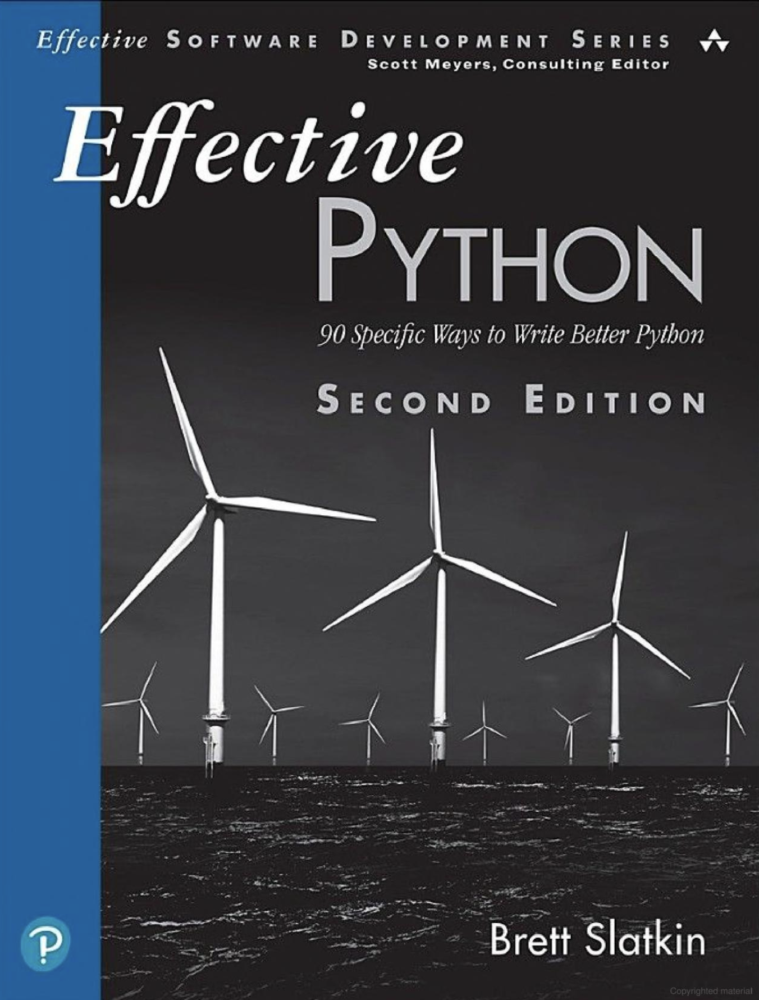

  

    
  

  This folder contains my notes from each chapter of the Effective Python book by Brett Slatkin. Every chapter covers a specific topic.
  All the images are from the book.    
  This summary includes the concepts and code snippets that I found interesting and is by no means comprehensive.