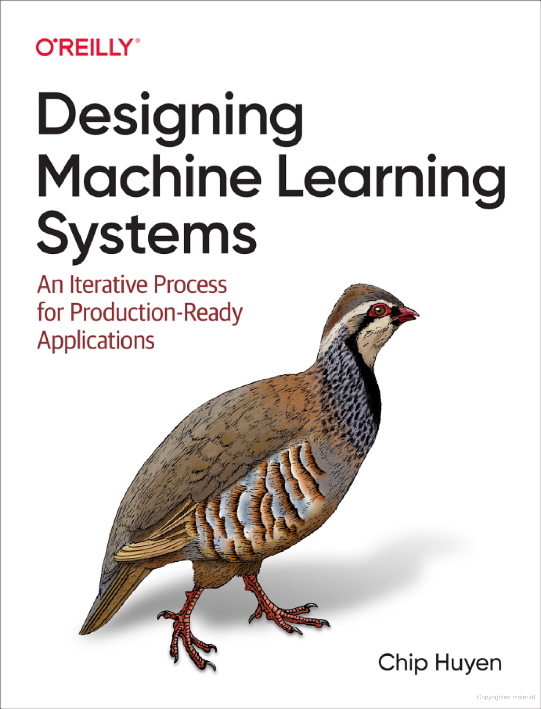

  

    
  

  This folder contains my notes from each chapter of Chip Huyen's ML system book. Every chapter covers an aspect of the machine learning pipeline from understanding the problem, to data sources, feature engineering, to deployment, monitoring, and so on.   
  All the images are from the book.    
  This summary includes the concepts that I found interesting and is by no means comprehensive. The author has a rather comprehensive set of documents on here github which can be found [here] (https://github.com/chiphuyen/dmls-book)