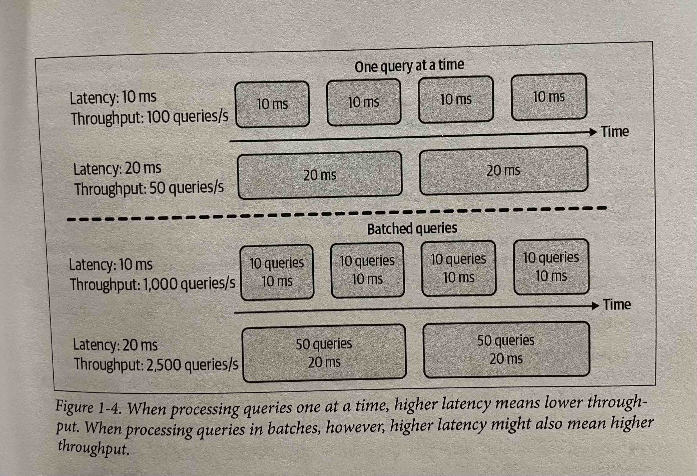

# Overview of Machine Learning Systems

Machine learning is a good candidate for problems with certain characteristics:

1. The system has a learning capacity
2. The learnable patterns in the system are complex
3. Data is available
4. It’s a predictive problem
5. The patterns seen in training data are repeated in the unseen data 
6. There are a lot of repetitive tasks
7. There are a lot of predictions to be made
8. The cost of making mistakes is low
9. The patterns change which cannot be hard-coded

## Latency and Throughput:

Latency is the amount of time that passes from receiving a request to returning the result. Throughput is the number of queries that are processed in a given time frame. Depending on how queries are handled by the system, reducing one could mean increasing the other. For example, if the system processes one query at a time, increasing the latency means that the system can process fewer queries at a given time. However, in a distributed system where batches of queries are processed concurrently, higher latency means higher throughput. For example, if a system processes 10 queries at a time and runs a batch in 10 ms, the latency is 10 ms and the throughput is 1000 queries/sec. Now if it takes 20 ms to run the batch of 50 queries, the latency is 20 ms and the throughput also increases to 2500 queries/sec.
  

    
  

### Reporting the Latency:
It's best to report latency in terms of percentiles rather than averages which is influenced by outliers. Common percentiles are p50 (median), p90, p95 and p99. The higher ones are good at detecting outliers which can suggest that something is not working as expected. Also, the higher percentiles correspond to a smaller percentage of users which is some cases are the most important ones, e.g. on Amazon's website the users with the highest latency are the ones with the most data and purchases and therefore the most valuable ones. 