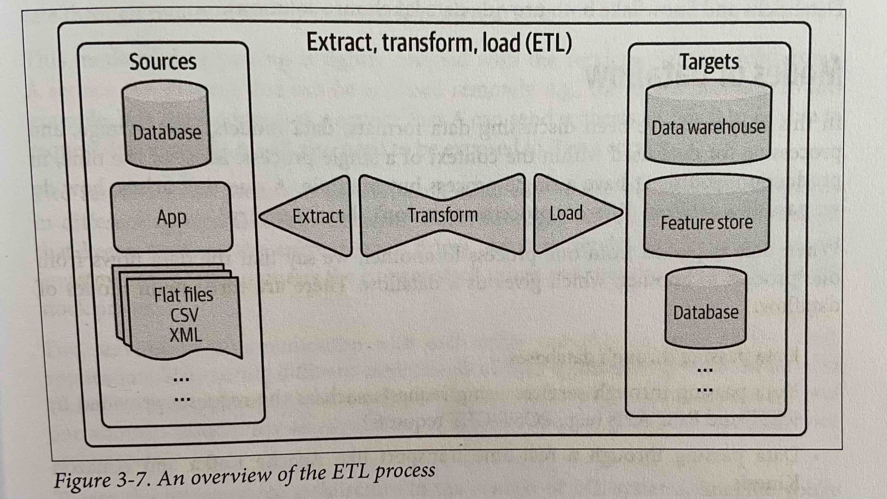
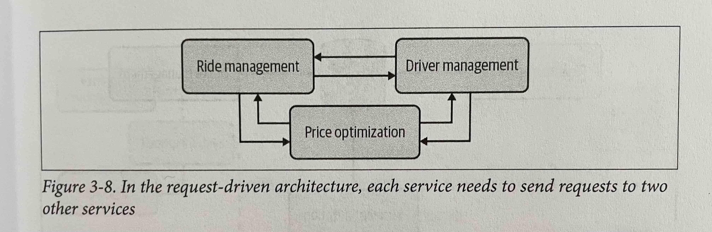
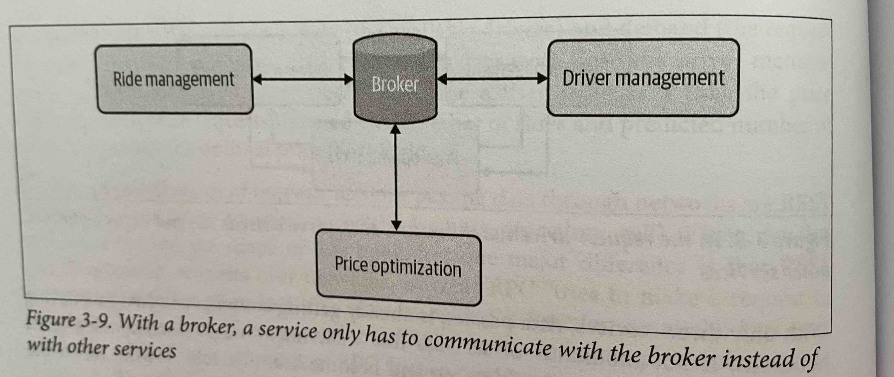
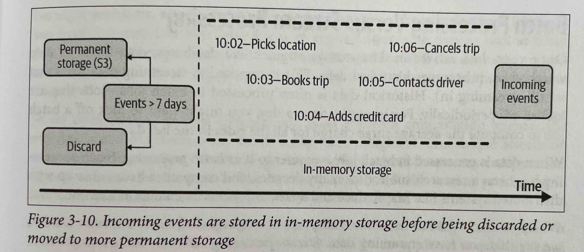

# Data Engineering Fundamentals
## Data Formats
### Row-Major Versus Column-Major Format
**Row-major**: In this format, consecutive elements in a row are stored next to each other in memory. For this reason, row-major formats are good for accessing samples. The CSV format is row-major. Row-major formats are more optimal for data writes.  
**Column-major**: In this format, consecutive elements in a column are stored next to each other in memory. Because of this, column-major formats are good for accessing features from the data. The Parquet format is column-major.   

**NumPy Versus Pandas**   
Pandas is column major and therefore slow when accessing data by rows. The major order in NumPy can be specified but is row-major by default. Therefore, NumPy is much faster than Pandas in accessing rows.

### Text Versus Binary Format
Text files, e.g. CSV and JSON are in plain text and human readable. Whereas binary files, e.g. Parquet are in 0s and 1s and generally more compact. AWS suggests Parquet format because they are 2x faster to upload and take up to 6x less storage space compared to text formats.

## Data Models
Data models describe how the data is presented. For example, in a database of cars, they can be presented using the make, model, colour and its year. Alternatively, the same cars can be presented using the license plate, owner, registered addresses, etc.   
It's important to choose a representation that suits the system's needs. If we want to build a system for selling cars for example, the first data model will be a good choice. However, if we want to build a system for a law enforcement department, the second model is preferred.    
In this chapter two common data models are described:   
### Relational Model
In this model data is presented in form of relations. Each relation is a set of tuples which form rows of a table. Databases built around the relational data model are relational databases. To retrieve the data from the database, you need to use a query language. SQL is the most common query language for relational databases which is a declarative language.  

**Declarative Versus Imperative Language**   
In an imperative language like Python, you specify the action steps needed to return an output. In a declarative language like SQL however, you specify the outputs and the computer figures out the actions needed to get those outputs.

### NoSQL
NoSQL models are generally non-relational, although some NoSQL data systems are Not Only SQL and support both relational and relational models. Two common non-relational data models are document models and graph models.

**Document Model**
In this model the data is in the form of self-contained documents and the relationship between documents is rare. A document is usually a continuous string in JSON, XML or BSON (Binary JSON) format. A document is equivalent to a row in a relational table. This modal is referred as schemaless because each document can have a different set of schema. However, this is not accurate as there is no predetermined set of schema enforced on each document during writing the data, but some assumptions about schema needs to be made when reading the data.

What are the advantages of the document model?   
1. Better locality: All the information about an entity can be found in its document, as opposed to be scattered across tables that need joins to retrieve.
1. Less restriction about schema during data writes

What are the disadvantages of the document model?   
    It's less efficient to execute joins across documents compared to tables

**Graph Model**
In this model, data is also in the form of documents but the emphasis is on the relationship between them. Given this, it is faster to retrieve data based on relationships.

Unstructured data is stored in data lakes and after being processed the storage repository is called data warehouse.

## Data Storage Engines and Processing
It's important to know about different types of databases and the workloads they are optimised for in order to choose the one that best fits your needs. There are generally two types of workloads databases are optimised forl transactional processing and analytical processing.
### Transactional Processing
Any action such as watching a video, ordering an item, tweeting is considered a transaction. Transactions are inserted as they are generated, modified when something changes and deleted when no longer needed. This processing is called online transaction processing (OLTP). 
Transactional databases need to have low latency and high availabilty given that they are user facing. In this regard they can be ACID:   
1. Atomicity: guarantees that all steps in a transaction are completed successfully. If one step fails all other steps must also fail. For instance, in a ride sharing app, if the rider's payment fails, a driver should not be assigned to them.
1. Consistency: guarantees that all the inserted transactions follow predefined rules and errors in the incoming data does not create unintented consequences. For example, a user has to be validated before the transaction is accepted.
1. Isolation: guarantees that two concurrent transactions happen as if they were isolated and occuring one by one. This ensures that concurrent data read/writes do not interfer with one another. For example, two users should not be allowed to book the same driver at the same time.
1. Durability: guarantees that once a committed transaction will remain committed, even if the system fails. For instance, if a user has ordered a ride, they should still get the ride even though their phone dies.   
Transactions are processed separately; therefore, transactional databases are usually row-major.
### Analytical Processing
On the other hand, analytical databases support aggregation of values in a column across multiple rows to answer questions such as the average ride price between 5 and 6 pm last week. Analytical processing is referred to as online analytical processing (OLAP).

Optimising databases for one process or the other, was a technological limitation of the past and today with decoupling storage and compute, many databases support both.
### ETL: Extract, Transform, and Load
ETL is the process of extracting the raw data from all the data sources, validating and rejecting the malformatted data. After extracting, the data is processed and transformed to the desired structure. An example of data transformation could be standardising the range of variables across different sources, e.g. the gender column can be strings from one source and numbers in another. After transformation, based on our decision about how and the frequency, the transformed data is loaded into the target destination, e.g. database, file, data warehouse.

### ELT: Extract, Load, and Transform
If we are not sure of the transformed data schema, we can store all the data in a data lake and leave the transformation to the application after loading the data into it. If the size of the data stored is very large, this process can become inefficient. 
## Modes of Dataflow
Usually in a real-world setting data flows from one process to another. There are three main modes of dataflow:
1. Data passing through databases
1. Data passing through services using requests, e.g. requests provided by REST and RPC APIs
1. Data passing through a real-time transport such as Apache Kafka and Amazon Kinesis

### Data Passing Through Databases
This is the easiest yet least practical mode of dataflow. In this setting, two processes will need access to the same database, e.g. process A writes to the database and process B reads that data from the database. Access to the same database may not be feasible if the two processes belong to different companies. Also, database read and writes increases latency and is not suitable for consumer-facing applications with low-latency requirements.

### Data Passing Through Services
A service is a process that can be accessed remotely, e.g. through a network. To pass data between processes through a network, the process that needs data, let's call it process A, needs to send the process with data, let's call it process B, a request with what it needs. For this request-driven communication to happen, B needs to be exposed to A as a service. If B needs any data from A, process A also needs to be exposed to B as a service. These services can be run by different companies. For example, a service can be from a stock exchange company that keeps track of current market prices. Another service can be an investment firm that requests the current stock prices to predict the future prices.
Services can also be part of the same application. Separating different processes into their own services allows each componenet to be developed, tested, and maintained independently of one another. This structure is known as the microservice architecture.   

**Microservices in an ML application**
Consider that a ride-sharing app has three services:
1. Driver Management Service: Predicts the number of available drivers in the next minute in any given area.
1. Ride Management Service: Predicts how many rides will be requested in the next minute in any given area.
1. Price Optimisation Service: Predicts the optimal price for each ride. The price has to be high enough for the drivers to accept but low enough for riders to be willing to accept the ride.   

Since the ride prices are affected by supply and demand, the price optimisation service needs data from both other services. Each time a user requests a ride, the price optimisation service requests the predicted number of drivers and riders from the ride management service and ride management services respectively.  
The most common styles of requests for dataflow through networks are REST (representational state transfer) and RPC (remote procedure call).

### Data Passing Through Real-Time Transport
Imagine in the example above that instead of the price optimisation service only requesting data from the other two services, each service needing data from the other two in order to make its prediction, e.g. the driver management service requesting the predicted prices from the price optimisation service to incentivise the drivers. The figure below shows the architecture. 

As can be seen, this interservice data passing can become very complicated as number of services grows. In addition, request-driven dataflows are synchronous: the target has to listen to the request for it to go through. If the target is down, the requester will keep sending the request until it times out. Also, if the sender service goes down before it receives a response, the response will be lost. Request-driven architecture works best for systems that rely on logic rather than data.   
A solution to this inefficient architecture can be using a broker. All services broadcast their updated predictions to this broker and any service that needs others' predictions can request the most recent updates from the broker rather than directly from each service.    
Databases can be used as a broker; each service writes data to it and other services read it, but this is slow. A better way is to use in-memory storage such as real-time transports. Data broadcast to a real-time transport is called an event. For this reason, a real-time transport architecture is called event-driven and a real-time transport is called an event bus.    
The two most common types of real-time transports are pub-sub (publish-subscribe) and message queue.    

**Pubsub**   
In this model, any service can publish to different topics and any service subscribed to those topics can read all the events published to it. The services that produce data don't care about what services consume their data. Pubsub solutions usually have a retention policy where they keep the data in the real-time transport for a period of time, e.g. a week and delete them or move them to a permanent storage such as Amazon S3.   
Examples of pubsub solutions are Apache Kafka and Amazon Kinesis. 

**Message Queue**   
In this modal an event known as a message usually has intended consumers. The message queue is responsible for getting the message to the right consumers. Examples of message queues are Apache RockerMQ and RabbitMQ.

## Batch Processing Versus Stream Processing
When data processing is done on historical data, i.e. data in data storage engines such as, warehouses, it is considered batch processing. Batch processes happen periodically, for example once a day and is usually perfomed to compute features that change less frequently such as a driver's ratings. MapReduce and Spark are some examples of distributed systems that process batch data efficiently. Features extracted from batch processing are called static features.   
Stream processing on the other hand, is perfomed more frequently, e.g. once every 5 minutes or whenever a request comes in from the user.    
The strength of stream processing is in its statefulness. This reduces the redundacies in computations. For example, consider a batch process that processes the user engagement in the last 30 days every day. Everyday the process recomputes information of the first 29 days. However, a stream process will join today's information with the old information. Features computed through stream processig are called dynamic features.    
You usually need both static and dynamic features in you machine learning system, so you need and infrastructure that allows you to do both.   
To do computation on stream data, you need a stream computation engine (the way MapReduce and Spark are batch computation engines). For simple stream computations, built-in stream computation capacity of real-time transports like Apache Kafka are sufficient, but ML systems that leverage streaming computation are rarely simple. The number of stream features in applications like fraud detections are easily in the order of hundreds if not thousands. The feature extraction logic can require joins and aggregations along different dimensions. For these cases, tools like Apache Flink, KSQL and Spark Streaming are good options. The first two are more well-known and provide a nice SQL abstraction.    

**Why is stream processing more difficult?**
1. The data amount is unbounded
1. Data comes in at variable rates and speeds

For these reasons it's easier to make a stream processor do batch processing than the other way around.