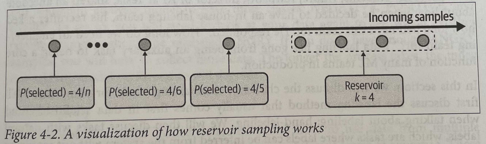
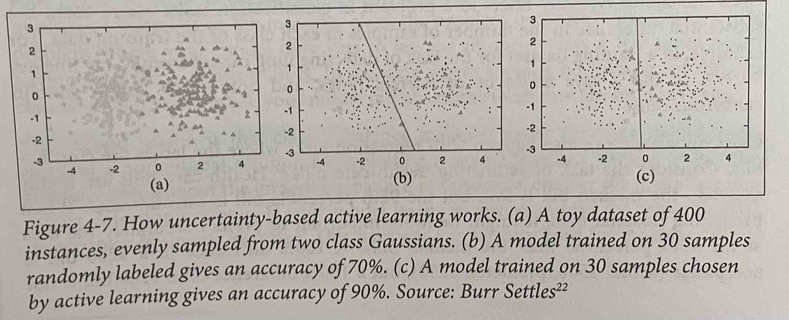

# Training Data
## Sampling
Sampling is useful when you don't have access to all the data. It is also useful for cases where you don't have enough time to analyse the entire dataset and want to run a quick experiment on a subset of data.   
Sampling happens in many steps of the machine learning lifecycle. For example, for creating the training data, data points from all real-world data are sampled. These data points are sampled to make training, validation and test splits. After deploying, data from the set of events are sampled for monitoring. It's important to know different methods and how they work to avoid sampling biases. There are two sampling categories, nonprobability sampling and random sampling.
### Nonprobability Sampling
When the selection of data is based on any probability criteria, for example:   

**Convenience Sampling**   
Data points are selected based on their availability.   

**Snowball Sampling**   
Existing samples determine future samples. For example, to scrape legitimate Twitter accounts without having access to Twitter's database, you start with a number of accounts and continue to scrape all accounts that they follow and so on.   

**Judgement Sampling**   
Domain experts decide what samples to include.   

**Quota Sampling**   
Samples are selected without randomisation from slices of the data based on quotas. For example, for a survey you want 100 responses from people under 30, between 30 and 60 and above 60 regardless of the distribution of each age group.   

Nonprobability sampling is not a good choice for collecting training data as it has selection bias. However, mostly convenience sampling is used for training machine learning models, e.g. for training sentiment analysis, IMDB and Amazon reviews are used which has bias towards those who are willing to leave reviews, have internet access, etc. and therefore is not representative of the population. Especially when these trained models are used for other sentiment analysis tasks.   
This method, is a quick and easy way to get started on your project, but probability-based sampling is more reliable.

### Simple Random Sampling
This is the simplest form of random sampling where each data point has an equal probability of being selected. The advantage of this method is that it is easy to implement; however, in the case of minority data groups the chances of being selected is very low. Models trained on this data may think the the minority group does not exist. 
### Stratified Sampling
To avoid the issue of simple random sampling. In this sampling method you first split your data into groups (each group is called a stratum) and then you sample from each stratum. This way the rare classes will be included in the samples. For example, if you want to sample 1% of the data with two groups A, B. You can sample 1% of stratum A and 1% of stratum B.   
An issue of this method is that it is not always possible split samples into groups, especially in multilabel tasks where one sample can belong to more than one group.
### Weighted Sampling
In this method, each sample is given a weight which determines the probability of it being selected. This is useful as it allows you to use your domain knowledge about the real world data. For example, if you know that more recent data is more important you can give it a higher weight and therefore a higher chance of getting sampled relative to older data.   
Weighted sampling is closely related to sample weights. In weighted sampling samples are weighted to be selected for creating training data, whereas in sample weights, samples in the training data are weighted to signify their importance. For example, you may weight the samples from a rare class higher to affect the loss function more and therefore change the decision boundary in such a way that the rare class is classified more accurately.
### Reservoir Sampling
This method is useful for sampling from streaming data. Assume that you have an incoming stream of tweets and you want to sample k tweets from it. You want each tweet to have equal probability of being selected but you don't know in advance how many tweets there will be in total to know the probability of each selection. Also, if you stop the sampling at any time you want all the tweets to have been selected with the correct probability. Reservoir sampling is the method that satisfies these criteria. It involves a reservoir which can be an array and consists of three steps:   
1. Put the first k elements into the reservoir.
1. For each incoming nth element, generate a random number i such that 1 $\leq$ i $\leq$ n.
1. If 1 $\leq$ i $\leq$ k: replace the ith element in the reservoir with the nth element. Else, do nothing.

This means that each incoming nth element has $k/n$ probability of being selected to be in the reservoir. You can also prove that each element in the reservoir has $k/n$ probability of being there. This means that all samples have equal probability of being selected and if we stop the selection at any time, all samples in the reservoir have been selected with the correct probability. The figure below illustrates how this sampling method works.

### Importance Sampling
This method is very useful as it allows us to sample from a distribution when we don't have access to it but only have access to another distribution. Suppose you want to sample $x$ from a distribution $P(x)$ which is infeasible to sample from. There is another distribution $Q(x)$ which is much easier to sample from. You can sample $x$ from $Q(x)$ and weigh it by $P(x)/Q(x)$. $Q(x)$ is called the *proposal distribution* or the *importance distribution* and can be any distribution as long as it is positive wherever $P(x)$ is non-zero. The following equation shows that in expectation, $x$ sampled from $P(x)$ is equal to $x$ sampled from $Q(x)$ weighted by $P(x)/Q(x)$:   
$E_P[x]=\sum_{x}P(x)x = \sum_{x} Q(x)x\frac{P(x)}{Q(x)} = E_Q[x\frac{P(x)}{Q(x)}]$

One use case of importance sampling is policy-based reinforcement learning. When updating the policy, the value functions of the new policy have to be estimated, but calculating the total rewards of taking an action can be costly because it requires considering all possible outcomes until the end of the time horizon after that action. However, if the new policy is relatively close to the old policy, you can calculate the total rewards based on the old policy and weight them according to the new policy. The rewards from the old policy make up the proposal distribution.
## Labeling
### Hand Labels
Manually labeling data points for creating training data can be problematic for a number of reasons:   
1. It's expensive. It can be very costly to have multiple annotators label your data especially if subject matter expertise is needed, e.g. board-certified radiologist.
1. Data privacy can be an issue. If you have sensitive data that needs labeling, it may not be possible to send data to annotators.
1. Data labeling is slow. It can take months for sufficient amount of data to be labeled which restricts you ability to adapt your model to changes in the real world. For example, consider a sentiment analysis model on a e-commerce platform that has been trained on annotated comments with POSITIVE or NEGATIVE labels. Assume that after launching, the PR team decides that they should care more about the angry comments and want a third label predicted, ANGRY. In this case, you would need to relabel your data which is not an easy process.
1. **Label multiplicity** : Another problem with hand labels is that different annotators might label the same data point differently. This is called data multiplicity. One way to mitigate it is to clearly define the labeling task, think of edge cases and communicate this with the annotators before they start labeling data.
1. **Data lineage**: Indiscriminately using data from multiple sources, generated from different annotators, without examining their quality can cause your model to fail mysteriously. It's good practice to keep track of the origin of each of your data samples as well as its labels, a technique called data lineage. It helps identify potential biases in the data and debug the model.
### Natural Labels
In some machine learning systems the model's predictions can automatically be evaluated (could be partial evaluation) by the system. An example is a model that estimates the travel time on Google Maps. If the user takes the suggested route, by the end of the trip, Google Map knows how long the trip actually took and can use this natural ground truth label to improve its model.    
Even if the task doesn't have inherently natural labels like the example above does, it can be be represented to the user in such a way to allow for feedback. For example, in a news feed app, allow for likes. 

**Feedback loop length**   
The amount of time it takes between the model prediction to receiving feedback is the feedback loop length, some products such as recommender systems in e-commerce websites have a short feedback loop, e.g. minutes. Others like Stitch Fix that recommends clothes and then sends them to the users have weeks long loops.   
There are also different types of user feedback that can be collected depending on the task and the objective. In an e-commerce website for example, clicking on the recommendation is one type of feedback, adding it to the cart is another and checking it out is an even stronger feedback. The clicks have a shorter feedback loop length and are higher in volume than checkout. Optimising for clicks therefore provides more retraining data, but you can argue that optimising for checkouts is more in line with the business objective of increasing revenue. There is no right or wrong answer here.   
Another aspect of the feedback loop is its length. How long should we wait to see if the recommendations were clicked on? If it's too short we might miss the clicks that happened after the feedback loop window ended and get false negative labels. But it allows you to capture labels faster and address issues with your model quicker. No matter how long your window length, there might be some premature negative labels.
### Handling Lack of Labels
**Weak Supervision**   
This is a programmatic way to label data based on different criteria, e.g. keyword heuristic, regular expressions, database lookups. Libraries like Snorkel are build around the concept of *labeling function (LF)*, a function that encodes heuristics. Different LFs may label the same samples differently. It's important to combine, denoise and reweight all LFs to get a set of labels that are most likely correct. Weak supervision has a number of advantages:
1. It is useful when data has strict privacy requirements, as not all the data needs to be looked at (only a subset that is cleared for writing LFs). 
1. You do not need any hand labels for weak supervision; however, it is useful to have a subset to get a better insight into how to write LFs and validate the correctness of them. 
1. It is much more cost efficient than hand labeling
1. It is highly adaptive. The LFs can be modified and used for relabeling data as the need arises
1. It is very fast and you don't need to wait weeks or months for the data to get labels by subject matter experts. 

You might think, if heuristics work, why do we need ML? LFs don't cover all the data samples, so models can be trained on the data labeled with LFs to generate predictions on samples that aren't covered by any LF.       
**Semi-supervision**   
Unlike weak supervision that relies on heuristics, semi-supervision makes structural assumptions about the data to generate labels based on an initial set of labels. There are two common semi-supervised methods:
1. Self-training: You train a model using the labeled data and use that to predict labels of the unlabeled samples. You then add the predictions with high raw probability to your labeled data and repeat the process until you have a model with satisfying performance.
1. Data points that share similar characteristics, have the same label. You can use clustering methods to find the similar points and then assign the same label to points in the same cluster.
1. Perturbation: This method assumes that small changes to the data points should not change its label. You can therefore increase the labeled data by perturbing the existing labeled ones, either directly, e.g. adding white noise to the images or indirectly, e.g. adding small numbers to their embeddings.   

One challenge in semi-supervision deciding on how much data to set aside for evaluation, if it's too small the best performing model can be overfitting, if it's too large, you have less data to train on. One solution to this is to use a reasonably large evaluation set to select the best performing model and then using the evaluation data to continue training that model.   
**Transfer learning**   
Transfer learning refers to the process of using a pretrained model as the starting point for your model on your task. Depending on the task the pretrained model was trained on, its data and the task you want to use it for, you can use it directly. This is called zero-shot learning, or you might need to fine-tune it by modifying some of it or all of it by continuing to train it on your data.    
Transfer learning is a great way to get started with a model that needs a lot of data without having a lot of data.   
**Active learning**   
Active learning is based on the idea that you can get a better performing model trained on fewer data points if those data points are more helpful in determining the underlying structure. In other words, instead of labeling the data randomly, label those that the model most struggles with and is most uncertain about. These hard data points can be found using different metrics or heuristics. Here some examples of metrics/heuristics:   
1. Prediction probabilities: Low raw probabilities can be used as a signal of uncertainty. You can select the data points with the lowest raw probabilities and label them. The figure below shows the performance gained by hand labeling 30 data points selected by active learning as opposed to labeling 30 random points.

1. Query-by-committee: Multiple models, usually the same models with different hyperparameters or same models trained on different slices of data vote on the predicted label of data points. The samples with the most disagreement is used for hand labeling.
1. Choose the samples that if used for training will give the highest gradient updates or will reduce the lost the most. 

## Class Imbalance
Class imbalance can happen in both classification and regression tasks. An example of imbalanced data in regression is estimating health-care bills which are generally highly skewed. The median bill is low but the 95th percentile is huge. It is much more costly to have errors for the larger numbers, a 100% difference for a median rate of $250 is acceptable but it is detrimental for $10K bill. Therefore, it is a good idea to train the model to be more accurate at predicting the 95th percentile at the cost of overall performance.  
**Challenges**   
ML, especially deep learning, performs well when the data is evenly distributed. Learning is difficult with imbalanced data for the following reasons:   
1. Having a few examples or no examples of a rare class doesn't give enough examples for the model to learn from and in the case of no examples at all, the model might assume that the rare class does not exist.
1. Class imbalance makes it easier for the model to get learn unuseful heuristics instead of anything meaningful about the underlying pattern of the data. 
1. Class imbalance leads to asymmetric costs of error as stated in the example earlier with predicting healthcare bills.

**How to handle it?**
1. Resampling: This is a data-level method as it aims at changing the underlying distribution of the training data. One way is *oversampling* which refers to the process of adding more instances of the minority class. The simplest way to add new samples is randomly make copies of the rare samples, this has the risk of overfitting though. There are more sophisticated methods such as SMOTE (synthetic minority oversampling technique) popular for oversampling low-dimensional data. Another resampling method is *undersampling* which is the opposite of oversampling where you remove samples from the majority classes. One way to do this is pick two samples that are from different classes but in proximity and remove the one from the majority class. This technique is called Tomek links. Undersampling however, has the risk of removing valuable information and although in the case of Tomek links will make the decision boundries clearer, it does not represent the real-world data you will be using your model for.   
There are some ways to mitigate the risks of resampling:   
    1. Two-phase learning: Train the model on the resampled data then fine-tune on the original data.
    1. Dynamic sampling: This method aims at showing the model less of what it has already learned and more of what it hasn't. It works by oversampling the low-performing classes and undersampling the high-performing ones during training.
1. Cost-sensitive learning: If making incorrect predictions for one class should be costlier than another class, you can enforce different costs for different classes. The loss caused by instance $x$ of class $i$ will be calculated as the weighted average of all possible classifications of instance $x$:   
$L(x; \theta) = \sum_{j}C_{ij}P(j|x; \theta)$

    The downside of this approach is that you need to manually set the cost matrix which varies for different tasks and scales.
1. Class-balanced loss: Is a way to mitigate the effects of data imbalance by having rarer classes have a higher weight in the loss function. A very basic way to do this is have the classes inversely weighted by the proportion of samples in that class.
1. Focal Loss: This is a specific loss function that aims at emphasising on the data points that are harder to learn by giving them a higher weight in the loss function.    
$FL(\rho_t) = -(1 - \rho_t)^{\gamma}log(\rho_t)$
## Data Augmentation
Data augmentation is the process of adding more data and is useful for cases where there is little training data but also in general to make the models more robust to noise and adversarial attacks.
### Simple Label-Preserving Transforms
This is an easy way to quickly double or triple your training data. For image data, you can rotate, flip, crop, invert, erase parts of the data, etc. without changing the label. For NLP tasks you can replace some of the words with synonyms by looking up a dictionary or finding words with close embeddings.
### Perturbation
Perturbation is another label-preserving transformation where noise is added to the data points to improve the learning process. Noise can be added either by adding random noise or by using a search strategy. *DeepFool* is an algorithm that finds the minimum possible noise injection needed to cause a misclassification with high confidence. This type of augmentation is called adversarial augmentation. 
### Data Synthesis
In NLP, templates is an easy way to bootstrap your model. For example, in a chatbot setting a template can look like: "Find me a [CUISINE] restaurant within [NUMBER] miles of [LOCATION]". You can replace [CUISINES] with all possible cuisines and so on.   
In computer vision, one way to synthesise new data is to combine existing examples with discrete labels to generate continuous labels. For example, if image $x_1$ is an image of a dog and image $x_2$ is an image of a cat, you can create a mixture of the two and generate a new sample $x'$. This is called mixup. It has shown to improve model's generalisation, reduces the model's memorisation of corrupt labels, increases the robustness to adversarial examples, and stabalises the training of generative adversarial networks.  