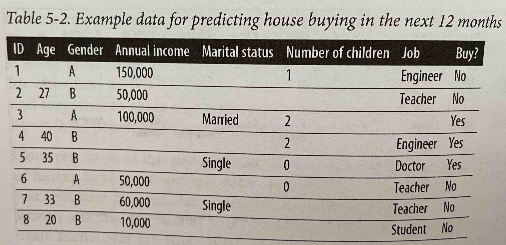

# Feature Engineering
## Common Feature Engineering Operations
### **Handling Missing Values**
Consider the problem of predicting whether someone is going to buy a house in the next 12 months with some sample data seen below. 

There are three types of missing values:     
1. **Missing not at random (MNAR)**: The true value itself is the reason for it being missing. For example in the table above, some of the income values are missing. It might be turn out after investigating that people with higher income were not comfortable sharing that information. In other words, the value is missing because of the value itself.
1. **Missing at random (MAR)**: In this case the value is not missing because of the value itself but because of the value of another observed variable. In the table above, the age of people of gender A is missing. This might be because people of this gender (another observed variable) are not comfortable sharing their age. 
1. **Missing completely at random (MCAR)**: This is when there is no pattern in when the value is missing. For example, the Job values in the above examples may be missing not because of the value itself or the value of any other variable but for no particular reason. People just forget to fill in some values. This is usually rarely the case and it's important to investigate why values are missing.

### Deletion   
Deletion is one way to handle missing values. It is the easiest but not the best way. One way to delete is *column* deletion: if a variable has too many missing values, just delete the variable. For example, in the above table more than 50% of the samples have Marital status missing and it might be tempting to remove that column all together. However, this may negatively impact the accuracy of the model because usually marital status is correlated to buying a house, e.g. married couples are more likely to purchase than single people.

Another way to delete missing values is *row* deletion: remove the sample that has a missing value altogether. This method can work if the missing values are MCAR and the number of samples with missing values is small, such as **less than 0.1%**. Row deletion is not effective if you have to throw out 10% of your data. However, if the missing data is not completely at random, removing those samples will affect the model performance. For instance removing the rows with missing annual income will be bad because having the income column missing likely correlates to buying a house which is what we want to predict. Also, if the missing values are at random, removing those samples can create biases in the model. For example, if we remove all the rows of gender A which have their age missing, our model will be biased towards gender B and not able to make good predictions for gender A correspondents.
### Imputation
Imputation means filling in the missing values with certain values. How do we figure out what these certain values are?   
1. Fill in with defaults, e.g. if the job is missing fill it with `""` 
1. Fill with the mean, median or mode. For example, if the temperature value is missing for a data sample with month value July, fill it with the median value of July
Be aware of filling in missing values with other possible values because it can create very hard to discover bugs. For instance do not fill in missing children with 0 which will make it hard to distinguish between people with no children and people who we do not have information of how many children they have. Another problematic example is filling in missing age with 0 and passing that to a model which has never seen 0 as an age value and made unreasonable predictions.
### **Scaling**
Scaling is one of the easiest ways to give your model a performance boost. To the model numbers are just numbers, it doesn't matter what feature it corresponds to, e.g. salary or age and the higher numbers in the salary may be interpreted as more important than lower numbers in a completely different feature, age for example. So it's important to scale your features before inputting them to models. Here are some common feature scaling methods:

1. Normalisation: Scales the features to be in the range of [0, 1]:

    $x' = \frac{x - min(x)}{max(x) - min(x)}$

    The author emprically has found that scaling to be in [-1, 1] range works better. Here is how you would scale the features to be within an arbitrary range of [a, b]:

    $x' = a + \frac{(x - min(x))(b - a)}{max(x) - min(x)}$

    Scaling to an arbitrary range works well when you don't want to make any assumptions about your variables
1. Standardisation: If you think that your features might follow a normal distribution, it might be useful to scale them to have zero mean and unit variance:

    $x' = \frac{x - \bar{x}}{\sigma}$
1. Log transformation: In practice ML models struggle with skewed distribution of features. This method doesn't work in all cases and you should be cautious of analysis performed on log-transformed data instead of original data:

    $x' = log(x)$
### **Discretisation**
Based on the author's experience discretisation rarely helps. It is the process of converting continuous features into discrete features. It is also known as quantisation and binning. It is done by creating buckets of given values and grouping all features with values within a certain range to that bucket. Theoretically, the point is that for a feature annual income, we want the model to treat $5900.5 the same as $60000. But the model sees them as different numbers and treats them differently. Assume we make three buckets for this feature:   
* Lower income: less than $35,000/year
* Middle income: between $35,000 and $100,000/year
* Upper income: more than $100,000/year

We can do the same with discrete features, e.g. age groups.    
The downside of discretisation is that it introduces discontinuities at the category boundaries - $34,999 is now different from $35,000 which is treated the same as $100,000. For choosing the boundaries plotting histograms, basic quantiles, and some subject matter expertise can help.
### **Encoding Categorical Features**
Categorical features are not always static, e.g. brands in a recommendation system, accounts in spam detection. If we train on a fixed range of indexes corresponding to all the categories existing in the training set, your system will break when an unseen category shows up. For example, consider an e-commerce recommendation engine where the training data has 2,000,000 brands so you encode them from 0 to 1,999,999. Then you push to production and get complaints because a certain unseen brand does not get any of its products recommended by your model because it is encoding it as UNKNOWN. You can change the behaviour by encoding the top 99% most popular product and encoding the least popular products as UNKNOWN. This way the model at least knows how to deal with UNKNOWN brands.    
Now the model works but the CTR on recommendations plummet. Because over the last hour 20 new brands joined your site with a mix of luxury and knock-off brands but your model treats them all as unpopular brands.   
This is a very common problem in many fields and use cases of ML in production. But how do you go about putting new user accounts into different groups?   
One solution to this is the *hashing trick*, popularised by the package Vowpal Wabbit developed at Microsoft. In this approach, you use a hash function to generate a hashed value of each category. The hashed value will become the index of that category. Because you can specify the hash space, you can fix the number of encoded values for a feature in advance, without having to know how many categories there will be. For example, if you choose a hash space of 18 bits, which corresponds to $2 ^{18} = 262,144$ possible hashed values, all the categories, even the ones your model has never seen before, will be encoded by an index between 0 and 262,144. 
### **Feature Crossing**
Feature crossing is the process of combining two or more features to generate new features. It is useful to model the nonlinear relationships between features and is therefore essential for models that can't learn or are bad at learning non-linear relationships, e.g. linear regression, logistic regression, and tree-based models. In addition, it occasionally helps neural networks learn nonlinear relationships faster. DeepFM and xDeepFM are the family of models that have successfully leveraged explicit feature interactions for recommender systems and CTR prediction.    
Feature crossing has some downsides:   
1. Your feature spaces blows up, because now you have multiples of the original features which requires a lot more data to learn all the possible values
1. Without more data the increased number of features leads to overfitting
### **Discrete and Continuous Positional Embeddings**
Embedding the positions is needed for when you want to process the inputs in parallel for the model to have a sense of the order of inputs. They can be learned or fixed using a predefined function usually sine and cosine. Fixed positional embeddings is a special case of what is called Fourier features. 
## Data Leakage
### **Common Causes**
### Splitting time-correlated data randomly instead of by time   
### Scaling before splitting   
### Filling in missing data with statistics from the test split   
### Poor handling of data duplication before splitting
### Group leakage   
### Leakage from data generation process
### Detecting Data Leakage
## Engineering Good Features
### Feature Importance
### Feature Generalisation   