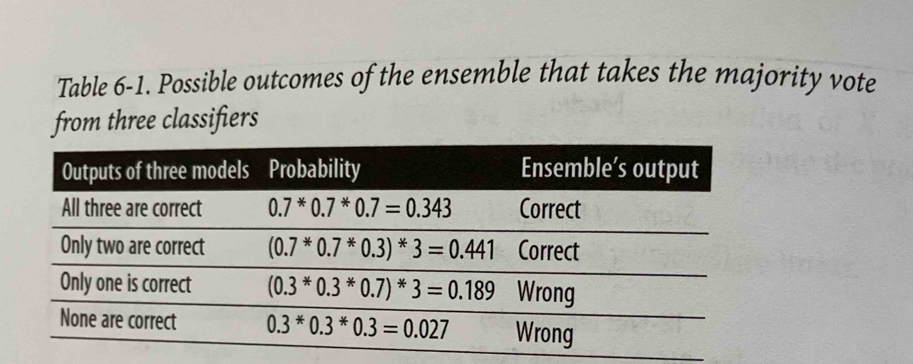
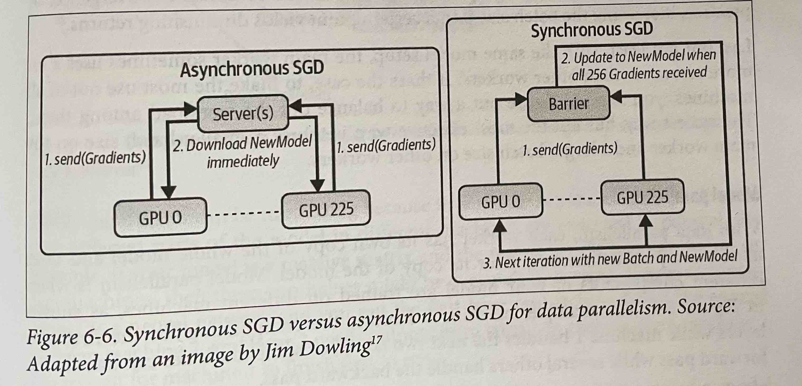

# Model Development and Offline Evaluation
## Model Development and Training
Deep learning is finding more use cases in production, but that doesn't mean the classical ML algorithms are going away. Many recommendation systems still rely on matrix factorisation and collaborative filtering. Tree-based algorithms, e.g. gradient-boosted trees powers a lot of classification tasks with strict latency requirements.   
It is also common for deep learning models to be used in tandem with calssical models. For example, a k-means clustering model might be used to extract features to input into a neural network. 
### **Evaluating ML Models**
When selecting a model, it's important to select a set of candidate models that fit the problem. For instance, if you want a text classifier, you can look into Naïve Bayes, logistic regression, RNNs, and transformer-based models. For fraud detection, you want to look at KNNs, isolation forest, clustering and neural networks.   
In order to know what models to consider based on your problem, you need to have knowledge about common ML tasks and typical approaches.
**Tip**: To keep yourself up to date iwth new ML techniques and models, monitor trends at major ML conferences, e.g. NeurIPS, ICLR, ICML as well as following researchers whose work has a high SNR on Twitter.
### 1. Avoid the state-of-the-art trap
The goal is to find a solution that works. If that solution is a cheaper and simpler approach than the fancy state-of-the-art, so be it.
### 2. Start with the simplest models
Simpler is better than complex. Simplity serves three purposes:   
1. Simpler models are easier to deploy and deploying early allows you to verify that your predicition pipeline is consistent with your training pipeline quicker.
1. Starting simple and adding complexity step by step makes it easier to understand the model and debug issues.
1. The simplest models can be used as a baseline for your future complex models.
### 3. Avoid human biases in selecting models
The performance of a model architecture heavily depends on the context, data, hyperparameters, etc. it is really important to not be biased towards a certain architecure and spend more time running experiments with it while running fewer tests on other architectures. For example, if you want to compare a tree-based model with a pretrained BERT model, run 100 experiments on both and not 100 on BERT and a few on the tree-based because you really want the more sophistaced model to be the better performing one.
### 4. Evaluate good performance now versus good performance later
Models degrade and its important to keep in mind that the best-performing model architecture you go live with may not be the best 2 months after. For example, you might start with a tree-based model at first because you have little data, but after going to production and collecting data you are able to train a neural network that outperforms the tree-based model.  
Another example is recommendation systems, a collaborative filtering method vs a neural network. At first the collaborative filtering might outperform the NN. However, the NN is much more efficient at online training and can update itself with each incoming example. Whereas the collaborative filtering would need to look at all the data to update its underlying matrix. One solution to this is to go live with both, have the collaborativ filtering make recommendations to users, while the NN uses the data to improve its predictions. Once you have enough data passed through the NN, and it outperforms the collaborative filtering, you can replace it with the NN.
### 5. Evaluate trade-offs
There are many trade-offs to be considered when developing a machine learning model. The classic example is the false postive and false negative trade-off. For a finger authentication app you would want to have lower false positives, whereas in a COVID-19 screening you would want to have fewer false negatives.  
There is also accuracy and compute or accuracy and interpretability trade-offs you would need to consider.
### 6. Understand your model's assumptions
It's important to know what assumptions your model makes about the data and whether your data satisfies those assumptions. Here is a list of common assumptions:
* IID: Neural networks assume that the samples are independent and identically distributed, which means that all examples are independently drawn from the same joint distribution.
* Smoothness: Every supervised method assumes that there's a set of functions that can map the input to the output such that similar inputs are transformed into similar outputs. 
* Tractability: Let X be the input and Z the latent representation of X. Every generative model makes the assumption that it's tractable to compute the probability P(Z|X).
* Boundries: Linear classifiers assume that the decision boundries are linear
* Conditional independence: A naïve bayes assumes that the attribute values are independent of each other given the class.
* Normally distributed: many statistical methods assume that the data is normally distributed.  
### **Ensembles**
Ensembles have consistently proven to provide performance boosts. However, they are less favoured in production because it is harder to deploy and maintain.   
If each base learner is uncorrelated with the others, using an ensemble will give you a performance boost. For example assume you have three spam detector base models each have a 70% chance of of being correct for each sample. The overall accuracy of an ensemble is as the table below shows, 0343 + 0.441 = 0.784 or 78.4%.

The less correlation there is between base learners, the better the ensemble will be. Therefore, it's common to choose very different types of models for an ensemble, e.g. transformer, RNN and a gradient-boosted tree.        

There are there three ways to create an ensemble:    

1. Bagging: Bootstrap aggregating where different datasets are created with random selection with replacement (with replacement so that the bootstraps are created independently from each other). This method reduces variance and helps to avoid overfitting.  
Bagging generally helps with improving unstable methods such as neural networks, classification and regression trees, and subset collection in linear regression. However, it can mildly degrade the performance of stable methods like KNN. 
1. Boosting: Boosting is a family of iterative ensemble algorithms that convert weak learners to strong ones. Each learner is trained on the same dataset but the samples have different weights in each iteration. The final strong classifier is a weighted combination of the existing classifiers-classifiers with smaller training errors have higher weights.
1. Stacking: In stacking you train base learners from the training data then create a meta learner that combine the outputs of the base learners either by majority vote or training another model that takes the base learners' output as its input.
### **Experiment Tracking**
Here's a list of useful things to track during training experiments:   
1. The *loss curve* corresponding to the train split and each of the eval splits.
1. The *model performance metrics* that you care about on all the nontest splits.
1. The log of *corresponding sample, prediction, and ground truth label*. This is useful for ad hoc analytics and sanity check.
1. The *speed* of your model evaluated by the number of steps per second or, if your data is text, the number of tokens processed per second.
1. *System performance* metrics such as memory usage and CPU/GPU utilisation. They're important in identifying bottlenecks and avoid wasting system resources.
1. The values over time of any *parameter* and *hyperparameter* whose changes can affect your model's performance, such as learning rate if a learning rate schedule is used; gradient norms (both globally and per layer), especially if you're clipping your gradient norms; and weight norm, especially if you're doing weight decay.   
### **Experiment Versioning** 
Data versioning is like flossing, everyone agrees it's a good thing to do, but few do it. 
### **Debugging ML Models**
Here are some common failure points of ML models:
1. Theoretical constraints: Each model has some assumptions about the data and features it uses. It can be that the inputs do not actually satisfy these assumptions, e.g the decision boundry is not linear but a linear model is used.
1. Poor implementation of the model: The model is a good fit but ther are bugs in the implemenation. For example, in PyTorch you might have forgotten to stop the gradient updates during evaluation.
1. Poor choice of hyperparameters
1. Data problems: Data samples and labels might be incorrectly paired, noisy labels, features are normalised using outdated statistics, etc.
1. Poor choice of features: Too many features can cause overfitting and can also cause data leakage. Too few features might lack predictive power for your models.

Here are a few tips for approaching debugging deep learning models.
1. Start simple and gradually add more components: Start with the simplest model and slowly add more components to see if it helps or not. For example, when building an RNN start with just one layer before adding multiple and using regularisation. If you want to use a BERT-like model which uses both a masked language model and next sentence prediction loss, you might want to use only the MLM loss before adding the NSP loss.
1. Overfit a single batch: After you have a simple implementation of the model, try to overfit a small amount of training data and run evaluation on the same data to make sure it gets to the smallest possible loss. For example, in an image recognition task, overfit on 10 images and see if you can get the accuracy to be 100%. Or in a MT taks overfit on 100 sentence pairs and see if you can get the BLEU score of near 100. If you can't overfit on small amount of data, there might be something wrong with the implementation.
1. Set a random seed: There are so many sources of randomisation in your model, e.g. weight initialisation, dropout, data shuffling, etc. which makes it hard to compare results across different experiments-you don't know if the change in performance is due to a change in the model or a different random seed. Set a random seet to ensure consistency between different runs. It also allows you to reproduce errors and other people to reproduce your results.
### **Distributed Training**
### What is the use case?
When you data doesn't fit into memory, your algorithms for preprocessing, (e.g. zero-centering, normalising, whitening), shuffling, and batching need to happen out of the core and in parallel.   
When a sample of data is too large that a machine can only handle a few examples at a time, the batch size will be too small which leads to gradient instability. So the data needs to be distributed across multipl machines to resolve this.   
In some cases, a single sample is too large, you can't fit it into memory. In this case a technique like gradient-checkpointing is usefule. It leverages the memory footprint and compute trade-off to make your system do more computation with less memory. Even when a sample fits into memory, using checkpointing can allow you to fit more samples into a batch, which might allow your model to train faster.
### Data Parallelism
This is the most common parallelisation method supported by modern ML frameworks. In this approach you split your data across multiple machines and train your model on all of them, and accumulate gradients. There are a couple of issues with this setup:    
1. A challenge is how to accurately and effectively accumulate gradients from different machines. Each machine produces its own gradients. You can either wait for each machine to finish a run. This is called synchronous stochastic gradient descent. The problem with synchronous SGD is that stagglers will slow down the entier system which has a higher likelihood of happening with higher number of machines. Alternatively, you can have your model update the weights using the gradients of each machine separately. This is called asynchronous SGD. The problem with this approach is gradient staleness because the gradients of one machine have caused the weights to change before the gradients from another machine have come in. As the number of weights increases, the gradient updates become sparse, so it becomes less likely for the same weights to get updated by the gradients from different machines. This makes gradient staleness less of a problem and the model converges similar to sync SGD.   
The figure below illustrates the difference between sync and async SGD.    

2. Spreading the data across multiple machines makes the batch size very big. For example, if one machine can process a batch size of 1000, now with 1000 machines you can process a batch of 1M. An intuitive solution could be to increase the learning rate to increase the learning at each step, but if it's too big it will lead to unstable convergence. In practice, increasing the batch size past a certain point yields diminishing returns.
3. With the same model setup, the main worker sometimes uses a lot more resources than other workers. In order to make the most use out of all the machines you need to balance out the workload among them. The easiest but not most effective way is to use a smaller batch size on the main worker and a larger batch size on the other workers.
### Model Parallelism
In this approach you split different model components across different machines. "Parallelism" can be confusing in this context becuase if your model is a neural network and you put the first layer on one machine and the next layer on another, the second machine has to wait for machine 1 to execute before it can run any computation. However *pipeline parallelism* is a technique to make different model components run more in parallel. The key idea is that it breaks down the computation of each machine into multiple parts. When machine 1 finishes the first part of its computation, it passes the result to machine 2, then continues to the second part and so on. Machine 2 now can execute its computation on the first part while machine 1 executes its computation on the second part. 
### **Auto ML**
### Soft AutoML: Hyperparameter tuning:
Any parameter that is defined by the user and helps with the learning process, such as, learning rate, batch size, number of hidden layers, number of hidden units, dropout probability, $\beta_1$, $beta_2$ for Adam optimiser, number of bits for quantisation. You must perform tuning on validation and report the model's final performance on the test split. Tuning on the test split has the risk of overfitting. 
### Hard AutoML: Archetecture Search and Learned Optimizer
Neural architecture search (NAS) for neural networks, is a research aread that searches for the optimal model architecture given three components:    
1. A search space: Defines possible architectures, i.e. building blocks and constraints on how they can be combined. 
1. A performance estimation strategy: Is used to evaluate the performance of each candidate architecture without needing to train it from scratch until convergence. 
1. A search strategy: Used to explore the space, e.g. random search, reinforcement learning (rewarding the choices the improve the performance estimation) and evolution (adding mutations to an architecture, choosing the best-performing ones, adding mutations to them and so on).
## Model Offline Evaluation
Evaluation metrics mean little out of context. When evaluating your model, it's essential to be evaluating it against meanigful baselines. The exact baselines willv vary from use case to use case, but here are five baselines that can be useful across use cases:    
### **Baselines**
1. Random baseline: What is the expected performance if the model genreates outputs randomly? The random predictions can be generated using different distributions e.g. uniform or task label's distibution.
1. Simple heuristic: What is the performance if you use some heuristic, e.g. order news feed items in chronological order.
1. Zero rule baseline: A special case of simple heuristic where the most common class is always predicted. For example, in predicting what app the user is going to use next, just recommend their most frequently used app. If this prediction is correct 70% of the time, any model you build has to significantly outperform this to justify its additional complexity.
1. Human baseline: Usually, the goal of ML is to automate human tasks. So it's useful to know how the model compares to human experts. 
1. Existing solutions: How does your model compare to existing solutions you are trying to replace.
### **Evaluation Methods**
It's important for models to be robust, fair, calibrated and to make sense overall. Here are some evaluation methods for these characteristics:
1. Perturbation tests: Ideally, the inputs to your model during development should be similar to inputs your model sees in production. But this is not possible in many cases. To get a sense of how your data might perform on noisy data, you can make small changes to your test splits to see how these changes affect your model's performance. 
If your model is not robust to these changes, it can be helpful to perturb the training data and use that in training. This way your model is more robust to changes in users' behaviour and adversarial attacks.
For example, if you are training a model on 2 sec audios of patients' coughs to detect if they have COVID, to make your model more robust to noise, you can randomly add some background noise or randomly clip the testing clips to simulate the variant in your users' recordings. You should choose the model that works best on the perturbed data instead of the one that works best on the clean data.
1. Invariance tests: Certain changes to the inputs should not change the output, e.g. changing the gender should not change their predicted salary. Your model should not have any sensitive information or proxies for it to begin with and if it does changing them should not change the output. Test this before making your model live.
1. Directional expectation tests: Some changes to the inputs however are expected to change the output in a certain direction, for example is a house price prediction model, while keeping everything the same, adding bedrooms should not decrease the price. If this is the case, it indicates the the model is not learning the right thing and requires investigation before deployment. 
1. Model calibration: If your model predicts that team A beats team B with a 70% probability but in reality it won 600 out of 1000 games, you would say your model is not calibrated. A calibrated model should predict a 60% probability.     
A common method for calibration is `Platt` scaling which is implemented in scikit-learn with `sklearn.calibration.CalibratedClassifierCV`.
1. Confidence measurement: Unlike most other metrics that measure the system's performance on average, confidence measurement is a metric for each individual sample, and can be thought of the usefulness threshold for each prediction. 
1. Slice-based evaluation: In this method, you split your data into subsets and look at the model's performance on each subset separately. There can be different reasons for why you want to consider the performance of different slices and not focus on the overall performance.    
    1. It can be an unfair model and doing slice-based evaluation helps understand the differences and make more informed decisions. For example, you might have model A with overall accuracy of 96.2%, 98% majority slice accuracy and 80% accuracy on the minority. And another model B with overall accuracy of 95%, majority accuracy of 95% and same accuracy for both slices. Knowing that model A has a lower minority accuracy you can look into improving the accuracy for the minority class and increas the overall accuracy of the model.
    1. Sometimes the model should perform differently on different slices and you need to verify that that is the case. For example, in a churn prediction model you need to have a more accurate churn prediction on paid subscribers.
    1. You might have Simpson's paradox, where you model overall is better than other models but when evaluated on the slices it is actually less performant. 
    Slice-base evaluation helps your understand how your model performs in more fine-grained way and can give you confidence in your model to convice stakeholders.
    But how do you know what your critical slices are in your data?
    1. Heuristics-base: Slice using domain knowledge you have of the data and the task at hand. For example when working with web traffice, you might want to slice your data along dimensions like mobile versus desktop, browser type, and locations. Mobile users behave very differently from desktop users. Similarly, users from different locations might have different expectations on what a website should look like.
    1. Error analysis: Manually go through misclassified examples and find patterns among them. For example, you might notice that all the errors are from mobile users and after slicing your data based on device you figure out that a button was half hidden on mobile screens.
    1. Slice finder: This is an active area of research that attempts to systemise the process of finding slices. The process starts with algorithms such as beam search, clustering or decision, then pruning out clearly bad candidates for slices, then ranking the left candidates.