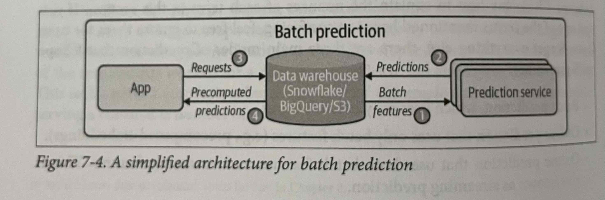
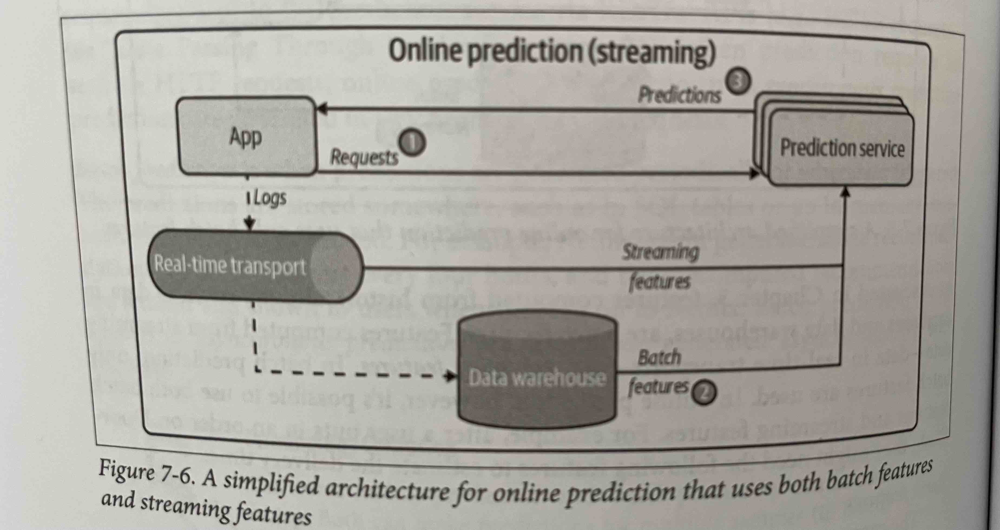
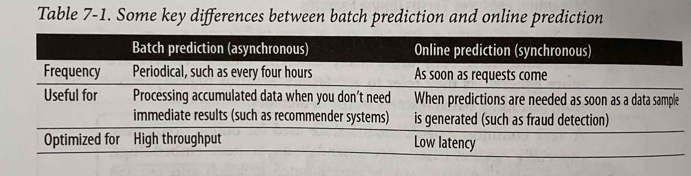
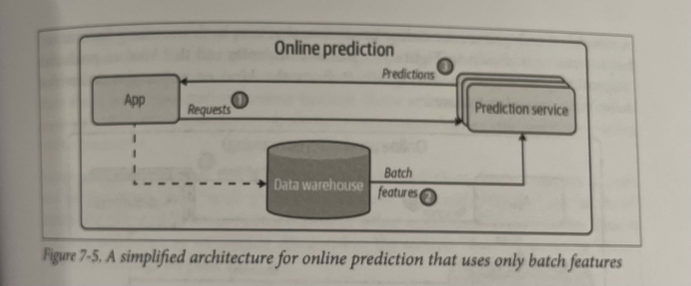

# Model Deployment and Prediction Service
## **Batch Prediction Versus Online Prediction**
There are three main modes of prediction:
1. Batch prediction or asynchronous predictions; this is when predictions are generated periodically or whenever triggered. The predictions are stored in database tables or in-memory data. For example, Netflix may generate movie recommendations for all of its users every 4 hours and the precomputed predictions are retrieved and displayed to users when they log in to their accounts. These predictions are asynchronous because they are generated asynchronously with requests. In batch prediction only features computed from historical data such as data in databases and warehouses is used.
1. Online predictions that uses only batch features, e.g. precomputed embeddings. Online prediction is also known as *on-demand prediction*. Traditionally, online prediction is made through requests that are sent to the prediction service via RESTful APIS, e.g. HTTP requests. When prediction requests are sent via HTTP requests, it is called *synchronous prediction* because the predictions are generated in synchronisation with requests.
1. Streaming prediction: Online prediction that uses both batch features and streaming features. For example, after a user puts in an order on DoorDash the following features may be used to estimate the delivery time:
    1. Batch features: The mean preparation time for this restaurant in the past
    1. Streaming features: In the last 10 minutes, how many other orders they have and how many delivery people are available.

## Online features vs batch features:
These two terms although used interchangeably are actually different. Online features are more general and refer to *any* feature used for online predictions including stored batch features.  A common batch feature used for online prediction, especially during session-based recommendations is item embeddings. These embeddings are usually precomputed and retrieved when needed for online prediction. 

Streaming features refer exclusively to features computed from streaming data. In the example above, the item embeddings are an online feature but not streaming feature.

The figures below show the architecture for batch and online prediction (using only batch features and both). Note that in both batch and online predictions can be made for multiple samples (a batch of samples) or one sample at a time.

The table below summarises the differences. On advantage of online predictions is that the predictions are only made for users who use your application. In other words, if you have 30 million users and predict recommendations for all on a daily basis, but only have 600,000 daily active users, 98% of your predictions will be wasted. 

The two prediction modes are not mutually exclusive and can be used together fore different use cases. For example, apps like DoorDash and UberEats use batch prediction to recommend restaurants as generating those predictions online will take too long. However, when the users click on a restaurant, the food recommendations are generated online. 
## From Batch Prediction to Online Prediction
Batch prediction can be used as a workaround for when online prediction isn't cheap enough or fast enough. It is good for when a lot of predictions need to be generated but the results are not needed immediately. However, it has some downsides and more and more companies are now investing to move from batch to online prediction. Here are some issues with batch prediction:
1. It is not responsive to user's preference changes. For example if you have been watching a lot of horror movies lately on Netflix, when you first log in to your account, this genre will be dominating most of the recommendations. But if you are in the mood of a comedy and start searching for movies in that genre, Netflix is not able to learn from that preference change and update its recommendations until the next batch prediction job. 
1. You need to know what to make predictions for in advance. In the case of recommendations, you know how many users to generate recommendations for. However, in the case of unpredictable queries, e.g. translation you do not no what the user is going to insert as a query and it is impossible to anticipate every single query.
1. In many cases, batch prediction can have catastrophic consequences or just not work. For example, autonomous vehicles, high-frequency trading, voice assistants, unlocking your phone using face or fingerprints, fall detection for elderly, and fraud detection. 
1. You need to generate many (maybe millions) of predictions in advance and worry about storing and retrieving them. Won't it be better if you could generate each prediction as needed at the exact same cost and speed?

To overcome the latency challenge of online prediction, two components are required:
1. A (near) real-time pipeline that can work with incoming data, extract streaming features (if needed), input them into a model and return a prediction in real time. A streaming pipeline with real-time transport and a stream computation engine can help with that.
1. A model that can generate predictions at a speed acceptable to its end users. For most consumer apps this means milliseconds.
## Unifying Batch Pipeline and Streaming Pipeline
If you use batch systems like MapReduce and Spark to periodically process large amounts of data efficiently you can't use that same infrastructure to make online predictions using streaming features. You will need a separate streaming pipeline for that.   
It is very common to extract features in a batch during training, but for inference compute them in a streaming process as shown in the figure below. This is a source of bugs as the two pipelines can compute different features for the same input because you forgot to correctly replicate the training pipeline in the inference pipeline.

Building infrastructure to unify stream processing and batch processing has become a popular topic in recent years for the ML community. Some companies including Uber and Weibo have made major efforts to unify their batch and stream processing using a stream processor like Apache Flink. Some companies use feature stores to ensure the consistency between the batch features used during training and the streaming features used in production. 
## **Model Compression**
## Low-Rank Factorisation
## Knowledge Distillation
## Pruning
## Quantisation

## **ML on the Cloud and on the Edge**
## Compiling and Optimising Models for Edge Devices
## ML in Browsers
