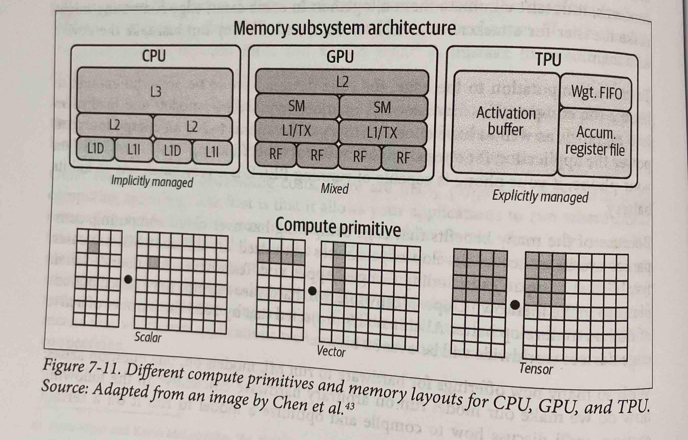
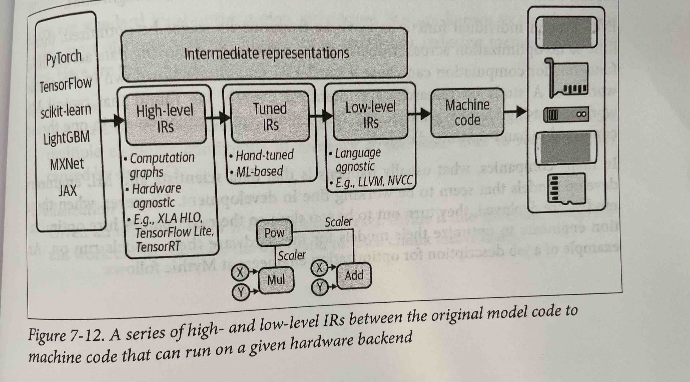

# Model Deployment and Prediction Service
## **Batch Prediction Versus Online Prediction**
There are three main modes of prediction:
1. Batch prediction or asynchronous predictions; this is when predictions are generated periodically or whenever triggered. The predictions are stored in database tables or in-memory data. For example, Netflix may generate movie recommendations for all of its users every 4 hours and the precomputed predictions are retrieved and displayed to users when they log in to their accounts. These predictions are asynchronous because they are generated asynchronously with requests. In batch prediction only features computed from historical data such as data in databases and warehouses is used.
1. Online predictions that uses only batch features, e.g. precomputed embeddings. Online prediction is also known as *on-demand prediction*. Traditionally, online prediction is made through requests that are sent to the prediction service via RESTful APIS, e.g. HTTP requests. When prediction requests are sent via HTTP requests, it is called *synchronous prediction* because the predictions are generated in synchronisation with requests.
1. Streaming prediction: Online prediction that uses both batch features and streaming features. For example, after a user puts in an order on DoorDash the following features may be used to estimate the delivery time:
    1. Batch features: The mean preparation time for this restaurant in the past
    1. Streaming features: In the last 10 minutes, how many other orders they have and how many delivery people are available.

## Online features vs batch features:
These two terms although used interchangeably are actually different. Online features are more general and refer to *any* feature used for online predictions including stored batch features.  A common batch feature used for online prediction, especially during session-based recommendations is item embeddings. These embeddings are usually precomputed and retrieved when needed for online prediction. 

Streaming features refer exclusively to features computed from streaming data. In the example above, the item embeddings are an online feature but not streaming feature.

The figures below show the architecture for batch and online prediction (using only batch features and both). Note that in both batch and online predictions can be made for multiple samples (a batch of samples) or one sample at a time.

The table below summarises the differences. On advantage of online predictions is that the predictions are only made for users who use your application. In other words, if you have 30 million users and predict recommendations for all on a daily basis, but only have 600,000 daily active users, 98% of your predictions will be wasted. 

The two prediction modes are not mutually exclusive and can be used together fore different use cases. For example, apps like DoorDash and UberEats use batch prediction to recommend restaurants as generating those predictions online will take too long. However, when the users click on a restaurant, the food recommendations are generated online. 
## From Batch Prediction to Online Prediction
Batch prediction can be used as a workaround for when online prediction isn't cheap enough or fast enough. It is good for when a lot of predictions need to be generated but the results are not needed immediately. However, it has some downsides and more and more companies are now investing to move from batch to online prediction. Here are some issues with batch prediction:
1. It is not responsive to user's preference changes. For example if you have been watching a lot of horror movies lately on Netflix, when you first log in to your account, this genre will be dominating most of the recommendations. But if you are in the mood of a comedy and start searching for movies in that genre, Netflix is not able to learn from that preference change and update its recommendations until the next batch prediction job. 
1. You need to know what to make predictions for in advance. In the case of recommendations, you know how many users to generate recommendations for. However, in the case of unpredictable queries, e.g. translation you do not no what the user is going to insert as a query and it is impossible to anticipate every single query.
1. In many cases, batch prediction can have catastrophic consequences or just not work. For example, autonomous vehicles, high-frequency trading, voice assistants, unlocking your phone using face or fingerprints, fall detection for elderly, and fraud detection. 
1. You need to generate many (maybe millions) of predictions in advance and worry about storing and retrieving them. Won't it be better if you could generate each prediction as needed at the exact same cost and speed?

To overcome the latency challenge of online prediction, two components are required:
1. A (near) real-time pipeline that can work with incoming data, extract streaming features (if needed), input them into a model and return a prediction in real time. A streaming pipeline with real-time transport and a stream computation engine can help with that.
1. A model that can generate predictions at a speed acceptable to its end users. For most consumer apps this means milliseconds.
## Unifying Batch Pipeline and Streaming Pipeline
If you use batch systems like MapReduce and Spark to periodically process large amounts of data efficiently you can't use that same infrastructure to make online predictions using streaming features. You will need a separate streaming pipeline for that.   
It is very common to extract features in a batch during training, but for inference compute them in a streaming process as shown in the figure below. This is a source of bugs as the two pipelines can compute different features for the same input because you forgot to correctly replicate the training pipeline in the inference pipeline.

Building infrastructure to unify stream processing and batch processing has become a popular topic in recent years for the ML community. Some companies including Uber and Weibo have made major efforts to unify their batch and stream processing using a stream processor like Apache Flink. Some companies use feature stores to ensure the consistency between the batch features used during training and the streaming features used in production. 
## **Model Compression**
If you want to improve the latency of your deployed model, there are three areas you can work on: 
1. Make the model generate predictions faster; this is called model optimisation
1. Make the model smaller; this is called model compression.
1. Make the hardware it is deployed on faster

We will go over four common model compression techniques:
## Low-Rank Factorisation
In this method, high-dimenstional tensors are replaced with lower-dimensional tensors. One type of low-rand factorisation is *compact convolutional filters*. This method used in convolutional neural networks decomposes the $K^2C$ parameter convolution operation with two steps, a depthwise $K$ x $K$ x 1 and a pointwise 1 x 1 x $C$ operation. Reducing it to $K^2 + C$ parameters.
## Knowledge Distillation
This is the process of training a smaller model, a student, to mimic a larger pretrained model or an ensemble of pretrained models, a teacher. An example is DistillBERT which reduces the number of parameters by 40% but is 60% faster and retains 97% of the language understanding of BERT. Usually distillation happens after the teacher has be trained but you can have the teacher and student to train simultaneously.
The downside of this approach is that you need a pretrained model and it is sensitive to applications and model architectures.
## Pruning
Pruning is a method originally used for decision trees to remove the tree sections that uncritical and redundant for prediction. In the context of neural networks it can mean two things:
1. Removing nodes all together and reducing the size of the model by changing the model architecture.
2. Setting unimportant nodes to zero and making the model sparse while keeping the architecture the same. This is a more common way of pruning and results in saving a lot of storage space while compromising overall accuracy. Pruning has the downside of introducing biases into you model.
## Quantisation
Quantisation is the most commonly used model compression technique that is generalisable to all architectures and tasks. In this technique, the number of bits used to represent the parameters are reduced. By default, most software packages use 32bits to represent a float number. a model with 100 million parameters will be around 400MB in this case. Using 16 bits instead will halve the size of the model. This is called *half precision*. You can reduce the number of bits even further and use 8 bits, this is called *fixed point*.
Reducing the size of models this way also results in faster computation for two reasons:
1. You can increase the batch size
1. Lower precision makes computations faster
The downside of quantisation is that with fewer bits to represent you numbers you have a more limited range and need to round/scale your bigger numbers. This can lead to overflow/underflow when rounding and also performance errors.

You can either do quatisation-aware training where you train the model with lower precision or you can quantise your model after training for inference.
## **ML on the Cloud and on the Edge**
On the edge means a large chunk of computation is done on consumer devices-such as browsers, phones, laptops, smartwatches, cars, security cameras, robots, embedded devices, FPGAs (field programmable gate arrays) and ASICs (application-specific integrated circuits) which are also known as edge devices.

Edge computing is appealing for a variety of reasons:
1. With more computation done on the edge there is less computations required on the cloud which costs less.
1. Edge computing allows your models to work in situations where there are no internet connections or where the connections are unreliable such as in rural areas or developing countries.
1. When the models are already on the consumer's devices, you can worry less about the network latency. Requiring data to transfer over the network, i.e. sending data to the model on the cloud to make predictions then sending the predictions back to the users might make some use cases impossible. In many cases network latency is a bigger bottleneck than inference latency. 
1. Easier to comply with data privacy regulations. 

To move computation to the edge, the edge devices have to be powerful enough to handle the computation, have enough memory to store ML models and load them into memory, as well as have enough battery or be connected to an energy source to power the application for a reasonable amount of time.
## Compiling and Optimising Models for Edge Devices
For a model build with a certain framework e.g. PyTorch, to run on a hardware backend, that framework has to be supported by the hardware vendor. Providing support for a framework on a hardware backend is time-consuming and engineering-intensive. Mapping from ML workloads to a hardware backend requires understanding and taking advantage of that hardware's design, and different hardware backends have different memory layouts and compute primitives as shown in the figure below.

 
For example the compute primitive of CPUs used to be a scaler and the compute primitive of GPUs used to be a one-dimensional vector, whereas the compute primitive of TPUs is a tensor (two-dimensional vector). Performing a convolution operator will be very different with one-dimensional vectors compared to two-dimensional vectors. Similarly you would need to take into account different L1, L2, and L3 layouts and buffer sizes to use them differently.
Because of this challenge, framework developers tend to focus on providing support to only a handful of server-class hardware, and hardware vendors tend to offer their own kernel libraries for a narrow range of frameworks. Deploying ML models to new hardware requires significant manual effort.    

Instead of targeting new compilers and libraries for every new hardware backend, what if we create a middleman to bridge frameworks and platforms? Framework developers will no longer have to support every type of hardware; they will only need to translate their framework code into this middleman. Hardware vendors can then support one middleman instead of multiple frameworks.

This type of middleman is called an intermediate representation (IR). IRs lie at the core of how compilers work. From the original code for a model, compilers generate a series of high- and low-level IRs before generating the code native to a hardware backend so that it can run on that hardware backend, as seen below. This process involves lowering the high-level framework code into low-level hardware-native code. 

 
After the code running you r models is lowered, it might be slow. The generated low-level code might not leverage the data locality and hardware caches, or advanced features like vector and parallel operations that could speed up the code. 

Note that even though individual functions in frameworks such as PyTorch, Numpy might be optimised, there's little or no optimisation across frameworks which ends up being most of ML application code. 

There are two ways to optimise ML models: locally and globally. Locally is when you optimise an operator or a set of operators of your model. Globally is when you optimise the entire computation graph end to end. Here are four techniques for speeding up models:   
1. Vectorisation: Given a loop or a nested loop, instead of executing it one item at a time, execute multiple elements contiguous in memory at a time to reduce latency caused by data I/O. 
1. Parallelisation: Given an n-dimensional array, divide it into different, independent work chunks, and do the operation on each chunk individually.
1. Loop tiling: Change the data accessing order in a loop to leverage hardware's memory layout and cache. This is hardware independent. A good access pattern on CPUs is not a good access pattern on GPUs.
1. Operator fusion: Fuse multiple operators into one to avoid redundant memory access. For example, two operators on the same array require two loops over that array. In a fused case, it's just one loop.
## ML in Browsers
It's possible to generate code that can run on any hardware backends by running that code in browsers. WebAssembly (WASM) is an open standard that allow you to run executable programs in browsers. After you've built your models in scikit-learn, PyTorch, etc. instead of compiling your models to run on specific hardware, you can compile your model to WASM. You get back and executable file that you can just use with JavaScript.

WASM is already much faster than JavaScript but still slower than running code natively on devices.